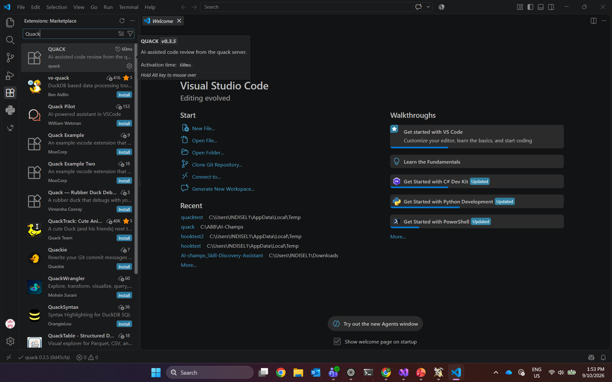
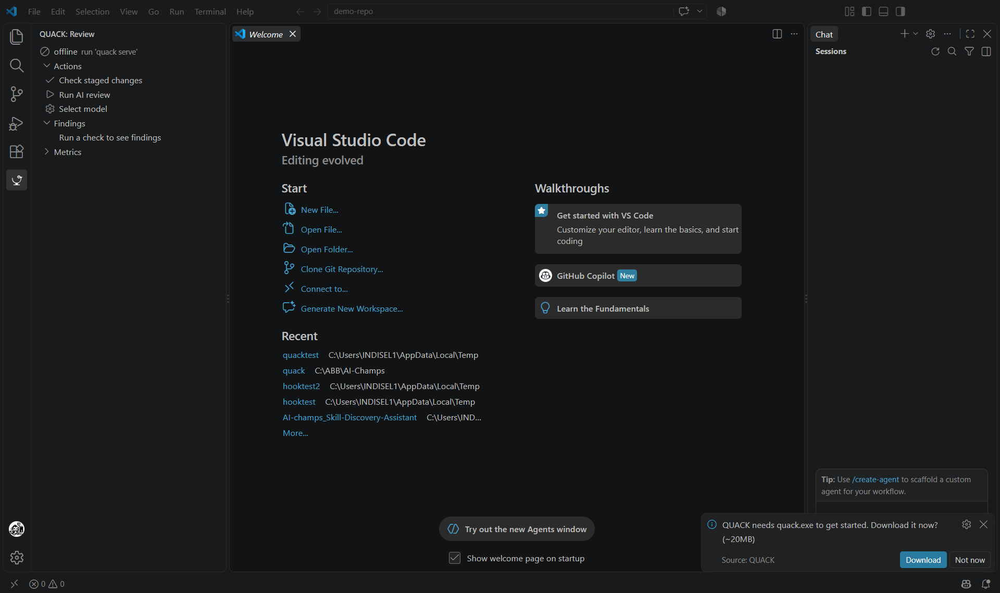
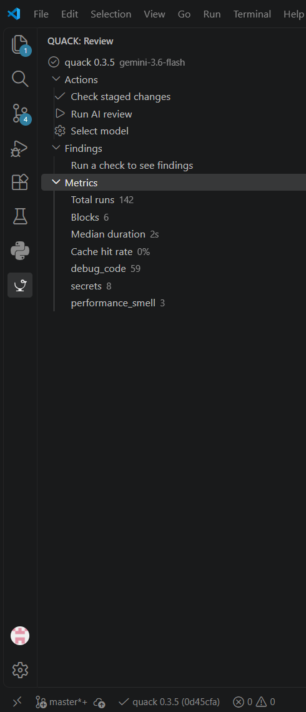
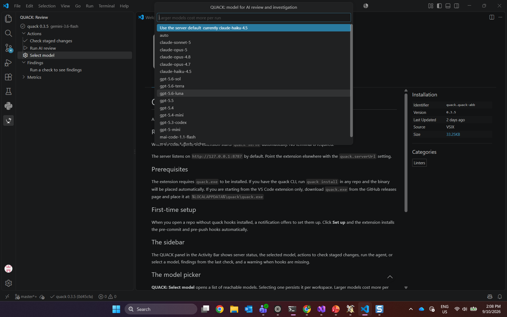
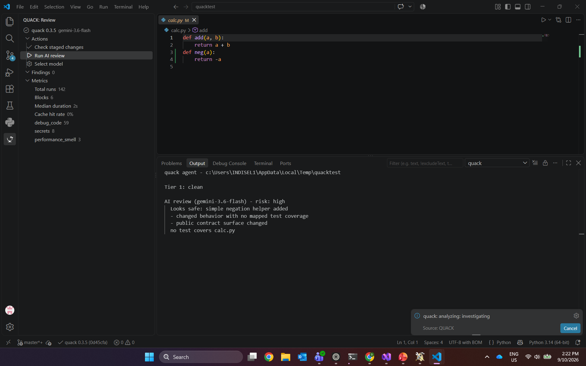
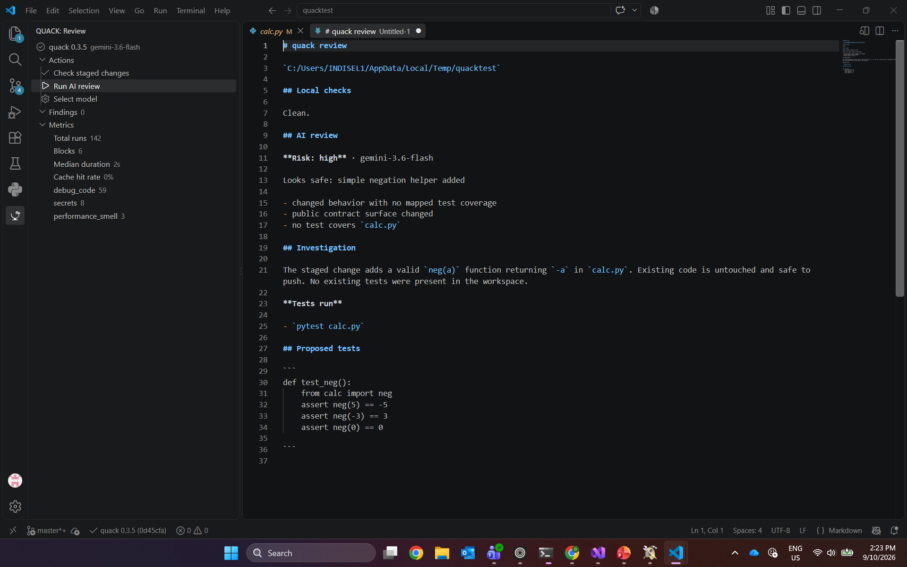

# QUACK for VS Code

QUACK brings local quality checks, AI-assisted review, repository
investigation, and usage metrics into VS Code.

## What you need

- VS Code 1.136 or later
- A Git repository opened as a folder in VS Code
- GitHub Copilot CLI installed and signed in
- The `quack-abb-<version>.vsix` file from the matching QUACK release

QUACK uses the Copilot CLI OAuth session. It does not require a GitHub Models
PAT or API key.

## 1. Install the extension

1. Download `quack-abb-<version>.vsix` from the GitHub release.
2. Open the **Extensions** view in VS Code with `Ctrl+Shift+X`.
3. Select the `...` menu at the top of the Extensions panel.
4. Select **Install from VSIX...**.
5. Choose the downloaded VSIX file.
6. Confirm that **QUACK** appears under installed extensions.



## 2. Start QUACK for the first time

Open a Git repository and select the duck icon in the Activity Bar.

If `%LOCALAPPDATA%\quack\quack.exe` is not installed, QUACK asks permission to
download the matching engine from the latest GitHub release. Select
**Download** and wait for the status to change from `offline` to a QUACK
version.



The extension starts `quack serve` automatically on
`http://127.0.0.1:8787`. A terminal does not need to remain open. To use an
existing server at another address, change the `quack.serverUrl` VS Code
setting.

## 3. Set up the repository

When QUACK detects a repository without its Git hooks, select **Set up** in the
notification or use the setup action in the QUACK sidebar.

QUACK installs:

- a pre-commit check for secrets, merge markers, debug code, and test guidance
- a pre-push AI review and repository investigation

Only deterministic secret and merge-marker findings block Git operations. AI
findings are advisory.

If the repository uses Husky, QUACK asks before modifying the tracked hook
files. Unsupported custom `core.hooksPath` configurations must be installed
manually with the instructions displayed by QUACK.

## 4. Learn the sidebar

The QUACK sidebar contains:

- the connected server version and selected model
- **Check staged changes**
- **Run AI review**
- **Select model**
- findings from the latest check
- local run metrics



The status bar also shows the connected version and build commit. If it says
`quack offline`, see [Troubleshooting](#troubleshooting).

## 5. Select a model

1. Select **Select model** in the QUACK sidebar.
2. Choose a model from the reachable Copilot catalog.
3. To follow the server configuration instead, choose **Use the server
   default**.



The choice is saved as `quack.model` in the current workspace. Larger models
can take longer and cost more per run.

If the picker displays only the server default, close it and run:

```powershell
quack model
```

A healthy result reports `Auth status: available` and lists reachable models.
If the CLI lists models but VS Code does not, restart the QUACK server or run
**Developer: Reload Window** from the Command Palette.

## 6. Check staged changes

1. Make and save a code change.
2. Stage the file with the Source Control view or `git add`.
3. Select **Check staged changes**.
4. Review the result in the QUACK sidebar and Problems panel.

This command is local and does not contact an AI provider. Secrets and merge
markers are reported as blocking errors; other findings remain advisory.

## 7. Run an AI review

Select **Run AI review** to review the staged change and start the read-only
repository investigation. Progress appears in a VS Code notification and
results stream into the **QUACK** output channel.



The completed report includes:

- deterministic local-check results
- AI risk and supporting observations
- repository investigation
- tests executed by the agent
- proposed tests or a proposed patch when applicable



Review the evidence before pushing. AI output is advisory and should not
replace normal code review.

## Daily workflow

1. Make a change.
2. Stage it.
3. Run **Check staged changes** for immediate local feedback.
4. Run **Run AI review** when you want deeper analysis.
5. Commit normally; the pre-commit hook repeats deterministic checks.
6. Push normally; the pre-push hook performs the configured advisory review.

## Commands

| Command | Purpose |
|---|---|
| **QUACK: Check staged changes** | Run deterministic checks and publish findings to the Problems panel. |
| **QUACK: Run AI review and investigation** | Run the AI review, inspect repository context, and execute allowed tests. |
| **QUACK: Select model** | Choose a reachable model for the current workspace. |

## Troubleshooting

| Problem | Resolution |
|---|---|
| `quack offline` | Wait for first-run setup, confirm `%LOCALAPPDATA%\quack\quack.exe` exists, or verify `quack.serverUrl`. |
| No executable download prompt appears | Download `quack.exe` from the matching GitHub release and place it in `%LOCALAPPDATA%\quack\quack.exe`. |
| Only the server default appears in the model picker | Run `quack model`. Sign in again with `copilot` and `/login` if authentication is unavailable, then restart the server or reload VS Code. |
| `Authorization error` | Remove ambient `GITHUB_TOKEN`, `GH_TOKEN`, or `COPILOT_GITHUB_TOKEN` values, then run `copilot` and `/login`. |
| Repository setup is not offered | Confirm that a Git repository folder, rather than an individual file, is open in VS Code. |
| Hooks use a custom path | Run `quack install` in a terminal and follow the displayed instructions. |
| Review appears stuck | Check the **QUACK** output channel. The first Copilot request can take longer while its runtime starts. |

## Privacy and blocking behavior

Local checks run entirely on the machine. When QUACK detects a staged secret,
analysis stops before any model is contacted, and the diff is not transmitted.
AI review and investigation use the authenticated Copilot SDK session.
